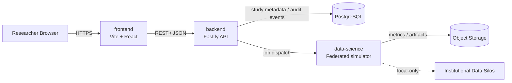

# BioMesh-AI

BioMesh-AI is an enterprise-oriented reference architecture for decentralized federated learning in clinical research. It separates clinical-facing APIs, privacy-preserving model simulation, and analytics presentation so that sensitive data can remain inside participating institutions.

## Architecture



### Repository layout

- `backend/`: TypeScript Node.js REST API. Owns API contracts, validation, authentication boundary, study metadata, health probes, and audit-event integration points.
- `data-science/`: Python federated-learning simulation. Owns client sampling, local training, secure aggregation seams, metrics, and experiment configuration.
- `frontend/`: Vite + React analytics dashboard shell. Owns researcher workflows and read-only visualization of training runs.
- `infra/`: Local infrastructure definitions and future deployment manifests.
- `docker-compose.yml`: Development topology for the API, simulator, dashboard, and PostgreSQL.

## Core principles

1. **Data locality**: raw clinical records never leave an institution; the simulator exchanges model updates and aggregate metrics only.
2. **Contract-first APIs**: request and response schemas are validated at the boundary and can later be published as OpenAPI.
3. **Least privilege**: each container has one responsibility and receives only the configuration it needs.
4. **Auditability**: study and training-run transitions are designed to emit immutable audit events.
5. **Reproducibility**: training configuration, random seeds, and dependency lock files belong with each experiment.

## Local development

### Prerequisites

- Docker Desktop with Compose v2
- Node.js 20+
- Python 3.11+

### Start the stack

```bash
docker compose up --build
```

Services:

- Dashboard: http://localhost:55173
- API: http://localhost:3000
- API health: http://localhost:3000/health
- PostgreSQL: localhost:55432 (`biomesh` / `biomesh_dev`)
- Redis: localhost:56379

### Run services without Docker

```bash
cd backend && npm install && npm run dev
cd data-science && python -m venv .venv && .venv\\Scripts\\activate && pip install -r requirements.txt && python -m biomesh_sim.cli
cd frontend && npm install && npm run dev
```

## API outline

- `GET /health`: liveness probe.
- `GET /ready`: dependency readiness probe.
- `GET /api/v1/studies`: list study metadata visible to the caller.
- `POST /api/v1/studies`: create a study after schema validation.

The API currently uses an in-memory repository to keep the bootstrap runnable. The repository interface is intentionally isolated so PostgreSQL and an identity provider can be added without changing route contracts.

## Federated workflow

1. A coordinator creates a study and selects an approved model configuration.
2. Participating sites train locally for a bounded number of epochs.
3. Clients send clipped, optionally noised updates to the coordinator.
4. The coordinator aggregates updates and records round-level metrics.
5. The dashboard consumes aggregate metrics; raw site data and individual updates remain unavailable to the browser.

## Security and compliance roadmap

This scaffold is not a clinical production system. Before production use, add OIDC authentication, authorization policies, TLS/mTLS, secret management, encrypted persistence, immutable audit storage, differential privacy accounting, secure aggregation, model-card review, data retention policies, threat modeling, and independent compliance review.

## Quality gates

Each service should add unit tests, contract tests, dependency scanning, secret scanning, container image scanning, and CI checks before deployment. See the service-level READMEs for the initial commands.
